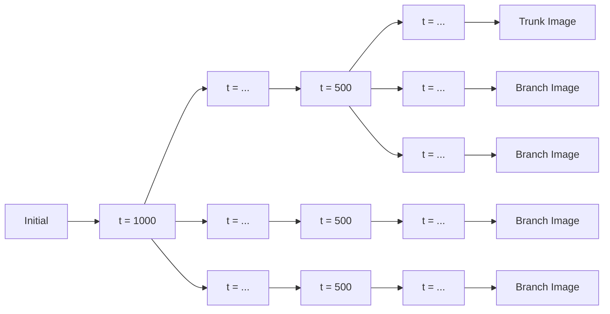

Diffusion Grid
==============

See: [**diffusion-grid.silverthorn.blog**](https://diffusion-grid.silverthorn.blog)

See also: [@bsilverthorn/diffusion-grid-banana](https://github.com/bsilverthorn/diffusion-grid-banana)

What?
-----

It's a simple visualization toy for [diffusion model](https://arxiv.org/pdf/2208.11970.pdf) trajectories.

It visualizes "paths not taken" during the denoising process.

It's a toy because it was built for playing around and building a bit of
intuition. It's not a tool for research or prompt development.

Explanation
-----------

When a diffusion model produces an image, that output is influenced by two
sources of randomness: its random initial position in latent space, and any
random decisions[^0] made throughout the denoising process.

We can imagine different trajectories, producing different images, all starting
from the same random initial position. If we focus on one of these trajectories,
we can also imagine different possible trajectories branching from each point on
that trunk, i.e., sets of trajectories that are all identical up to a given
timestep. Trajectories branching from later timesteps[^1] will be more similar
than trajectories branching from earlier timesteps.

This toy shows images produced by several trajectories branching from each of
several different timesteps, along these lines:

Motivation
----------

I was curious about the emergence of image structure within the reverse trajectory. What kind of "choices" are made earlier? Later?

One way to visualize that emergence is to look at multiple trajectories with
differing similarity, as described above, which also turns out to be visually
interesting and kind of fun to play around with.

(If you have pointers to any of these topics in the literature, please pass them
along.)

[^0]: Decisions of a nondeterministic scheduler, in this case [DDIM](https://arxiv.org/pdf/2010.02502.pdf) with $\eta > 0$.

[^1]: Later or earlier from the perspective of the denoising process, which sees larger timesteps before smaller.
